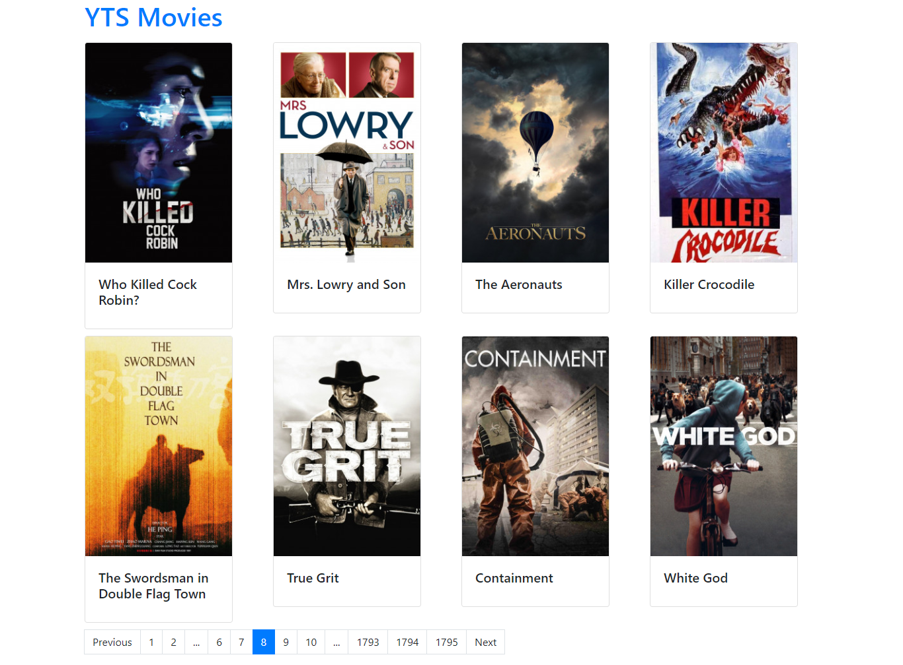

# React - Pagination Example

[react-paginate](https://www.npmjs.com/package/react-paginate) - A ReactJS component to render a pagination.



## Steps to Setup

1. Clone this repository

```
git clone https://github.com/MarioCesarJr/react-pagination.git
```

2. Install dependencies

```bash
> yarn
```

3. Run app

```bash
> yarn start
```

Open <http://localhost:3000> to view it in the browser.

## Author

- [Mário Cesar de Souza Junior](https://github.com/MarioCesarJr)
